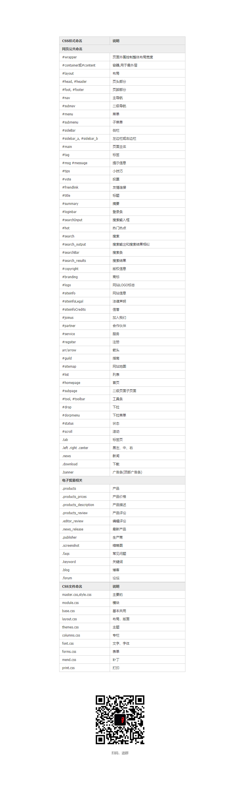
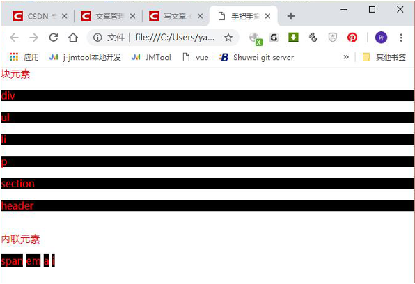
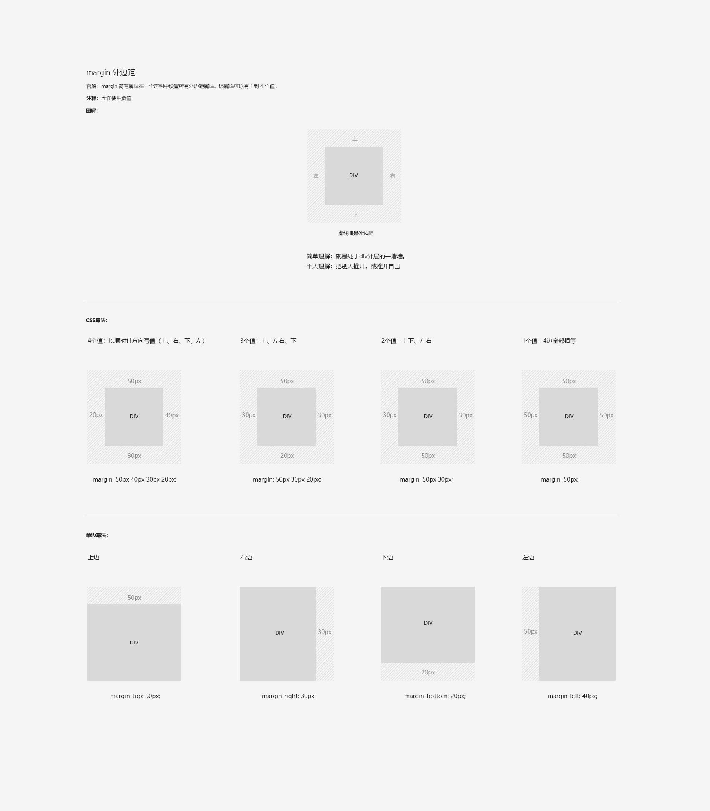
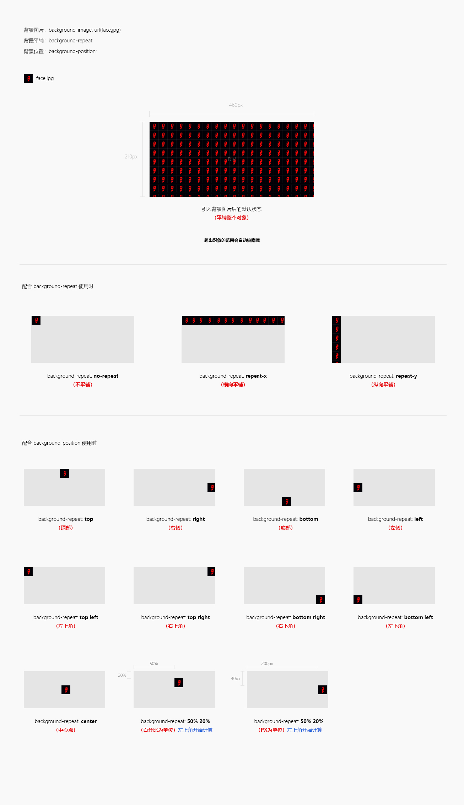
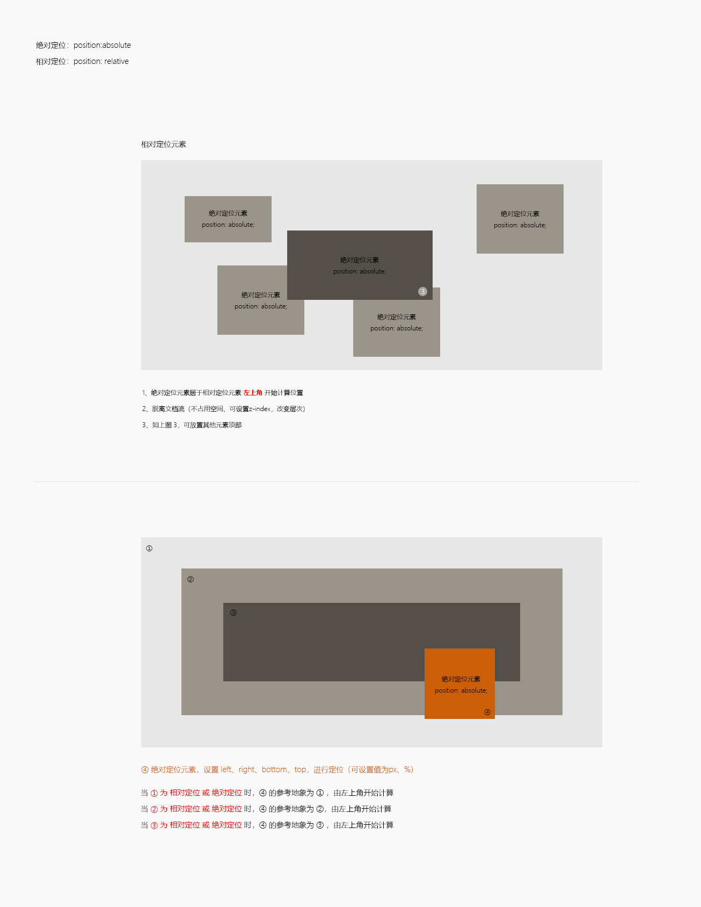
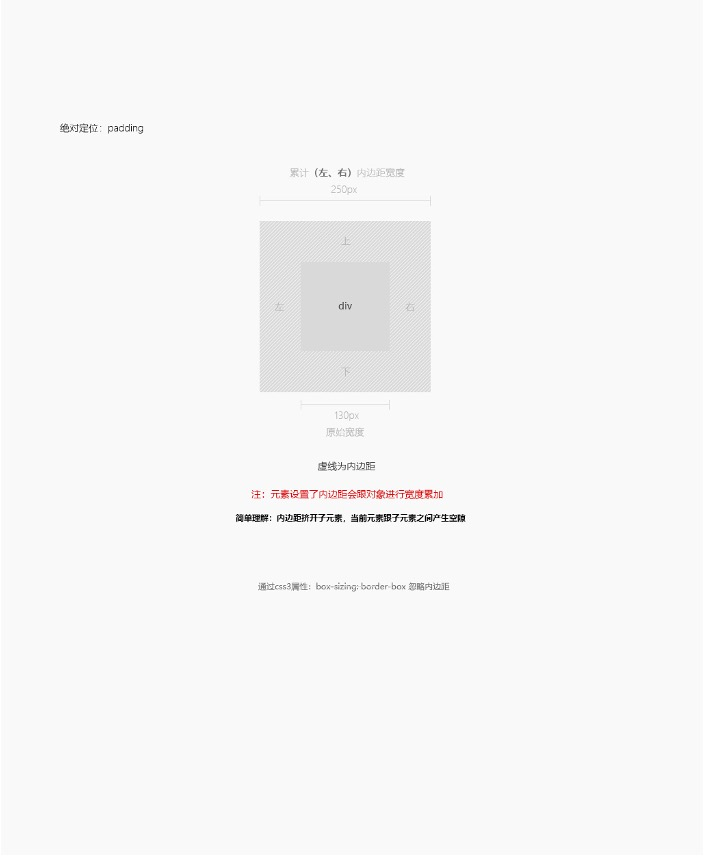
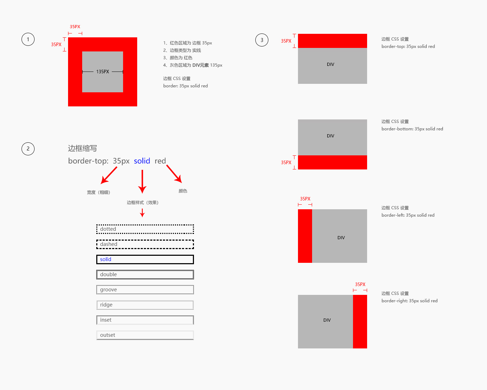
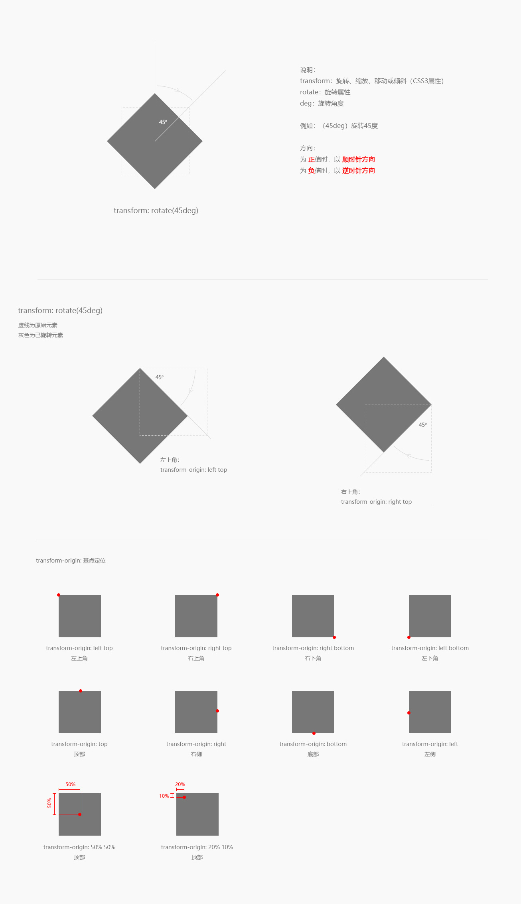
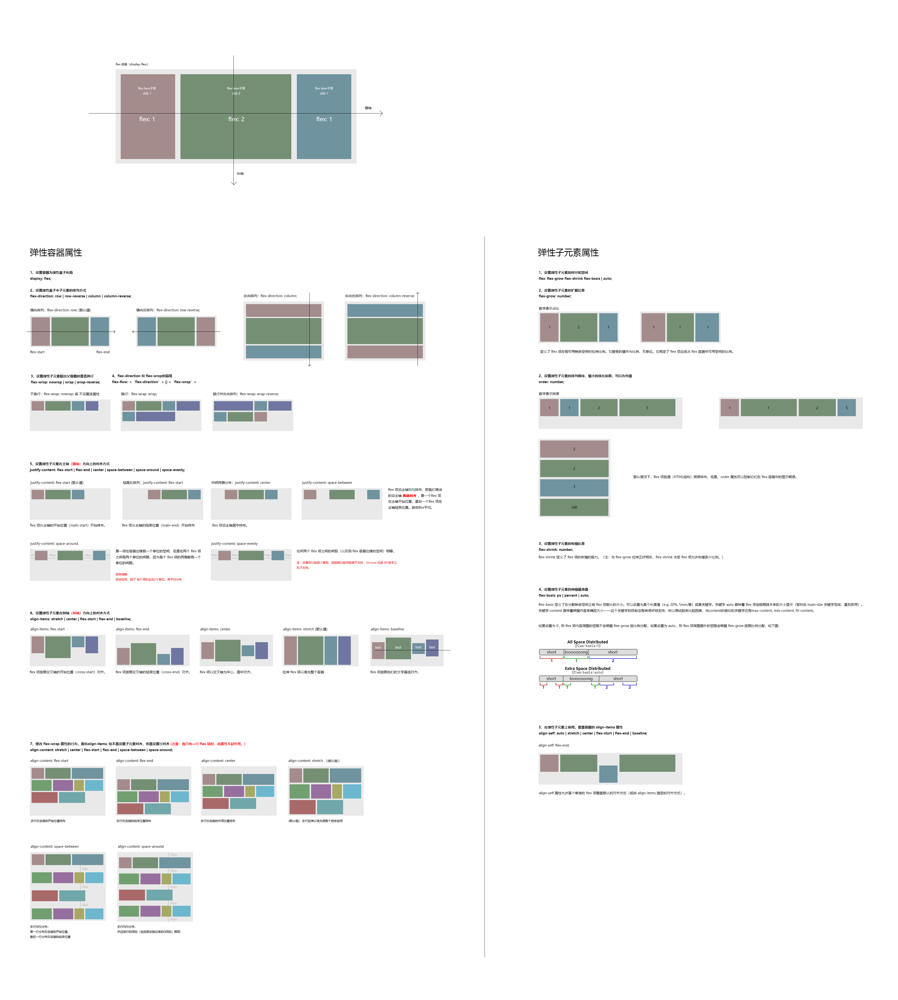

# CSS

## 命名规范




## CSS书写顺序（ 以盖楼房说明 ）

1、位置属性：position、top、right、z-index、display、float （找位置在哪里盖楼房）

2、尺寸大小：width、height、padding、margin （规定每栋楼的大小）

3、背景边框：background、border （起水泥柱、上砖、批灰）

4、文字系列：font、line-height、letter-spacing、color- text-align（房间的装饰、摆个沙发、挂个画什么的）

5、其他：animation、transition（后期的配套设备，如：超市、银行、医院。因为是后台来的所以放最后）

## 块元素、内联元素的识别

块级元素：就是占据页面整行的，如下图：有 div、ul、li、p、section、header、footer…等等。

内联元素：不占据页面整行，可以拼在一起的。 如下图：span、a、em、i、b…等等



|块级元素|行内元素|
|----|:----:|
| 独占一行, 默认情况下，其宽度自动填满其父元素宽度 | 相邻的行内元素会排列在同一行里，直到一行排不下，才会换行，其宽度随元素的内容而变化 |
| 可以设置width，height属性 | 行内元素设置width，height属性无效 |
| 可以设置margin和padding属性 | 行内元素设置width，height属性无效 |
| 对应于display:block | 对应于display:inline； |

### float、clearfix 浮动常见bug

最常见的bug，浮动问题：float: left、float: right

造成严重的问题：当 “子级” 元素使用 float 时，无法撑开 “父级” 元素高度，后续的布局越来越乱。

解决方式：当 “子级” 元素使用 float 时，父级一定要清除浮动（clearfix）。

::: tip
常见三种：

1、 添加新的元素 、应用 clear：both；不好之外：额外增加了一个无意义的标签，有点占用资源。
2、父级上增加属性overflow：hidden；不好之外就在于超出的元素会被隐藏，看不见
3、定义一个伪类的css样式，把clearfix添加到父元素。

:::

``` css
.clearfix:after {
    content: ".";
    display: block;
    height: 0;
    clear: both;
    visibility: hidden;
}

.clearfix {
    display: inline-block;
}

* html .clearfix {

    height: 1%;
}

.clearfix {
    display: block;
}
```

## Margin



## 中文（小箭头的三种制作方式）

第一种：background-image



第二种：对象边框配合css3 配置


第三种：伪元素:before、:after

``` css
elem:before {
    Content: ‘’
}

elem::before {
    Content: ‘’
}
```

## Position定位、脱离文档

绝对定位：position: absolute; 

相对定位：position: relative; 

::: tip
记住一个重要的概念：绝对定位元素，居于“相对定位” 或 “绝对定位”的元素进行定位
:::

简单的理解就是：绝对定位元素，需要一个参考对象（父级元素），参考对象的属性是 “相对定位” 或 “绝对定位”

通过设置top、right 、bottom 、left 进行定位，常使用的值为px、%

Padding的值会累加到元素本身

如：元素本身的值 为100px，设置padding-left: 50px；那么：元素本身的值就变为了150px



## Padding内边距

简单理解：内边距挤开子元素，当前元素跟子元素之间产生空隙

::: tip
注：元素设置了内边距会跟对象进行宽度累加
通过css3属性：box-sizing: border-box 忽略内边距
:::



## Transition 过渡

1、transition-property：规定应用过渡的 CSS 属性的名称。

2、transition-duration：定义过渡效果花费的时间。默认是 0。

3、transition-timing-function：规定过渡效果的时间曲线。

4、transition-delay：规定过渡效果何时开始。默认是 0。

在线效果：

``` html
<a href="https://cubic-bezier.com/#.25,.1,.25,1" target="_blank">查看效果</a>
```

::: tip
推荐的写法：transition: all 1s linear .5s; 
:::

## animation 动画、@keyframes

animation-name                     规定需要绑定到选择器的 keyframe 名称。。

animation-duration                规定完成动画所花费的时间，以秒或毫秒计。

animation-timing-function     规定动画的速度曲线。

animation-delay                     规定在动画开始之前的延迟。

animation-iteration-count      规定动画应该播放的次数。 n | infinite

animation-direction               规定是否应该轮流反向播放动画。 normal | alternate

::: tip
推荐的写法：animation: name 5s infinite; 
:::

## CSS权重（传统计算方式）

|类型       |            权重 | | 栗子 |
| ------------- |:-------------:| |:-------------:| 
|  ! important   |  无穷   |  |
|  行间样式   |  1000   | style |
|  id   |  100   | #id |
|  class/属性选择器/伪类/伪元素    |  10   | class/属性选择器/伪类/伪元素 |
|  标签选择器   |  1   | div |
|  通配符   |  0   | * |

::: tip
如何正确计算权重值，请看这里（其实我也看不懂，所以有强调过，写CSS层次时，尽量不要超过4层）

``` html
<a href="https://www.cnblogs.com/shinnyChen/p/3771065.html" target="_blank">查看</a>
```

:::


##  CSS3超出文字省略号（单行、多行）

display: -webkit-box;

-webkit-line-clamp:2;

-webkit-box-orient: vertical;

overflow: hidden;

-webkit-line-clamp 用来限制在一个块元素显示的文本的行数。 为了实现该效果，它需要组合其他的WebKit属性。

display: -webkit-box 必须结合的属性 ，将对象作为弹性伸缩盒子模型显示 。 

-webkit-box-orient 必须结合的属性 ，设置或检索伸缩盒对象的子元素的排列方式 。


## CSS3 background-size属性、占位图解决图片大小不一问题
```
background-size：
Contain：图片自身的宽高比例不变，缩放至图片自身能完全显示出来，所以容器会有留白区域；
Cover：图片宽高比例不变、铺满整个容器的宽高，而图片多出的部分则会被截掉；
```


## 边框



## Transfrom-Rotate



## Flex


